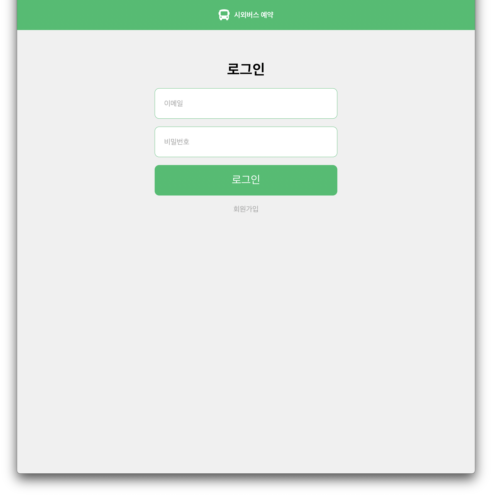
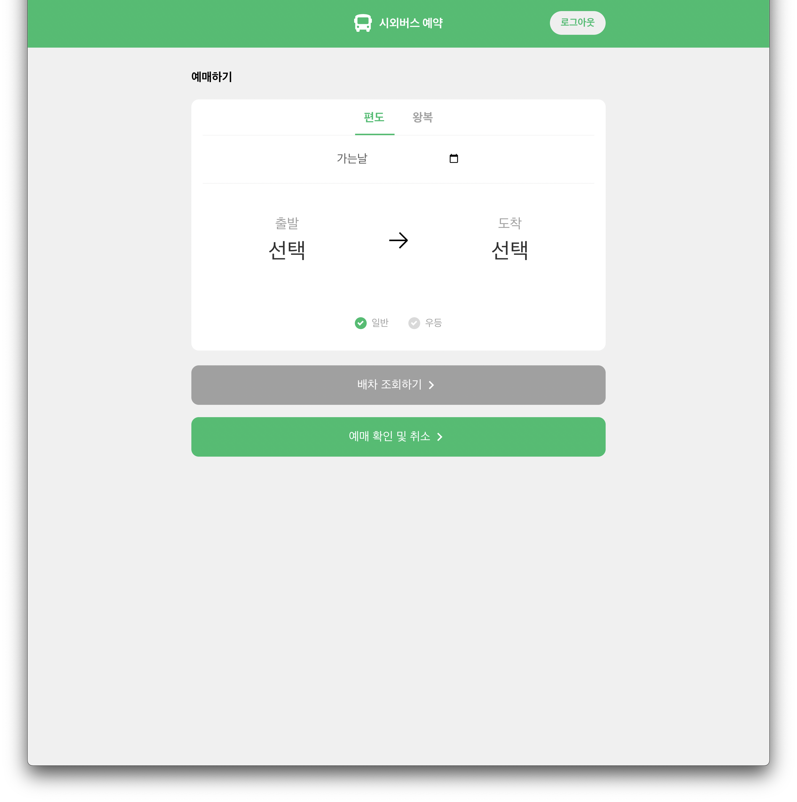
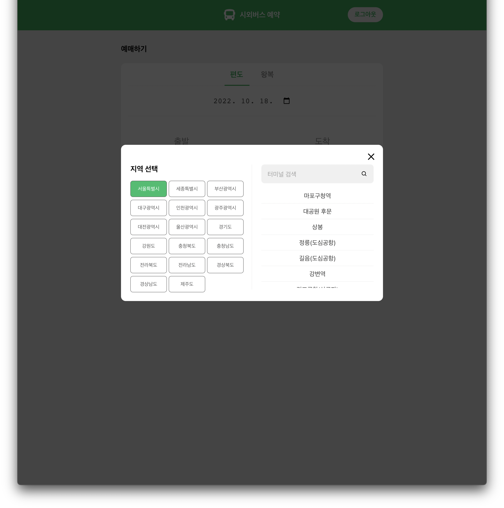
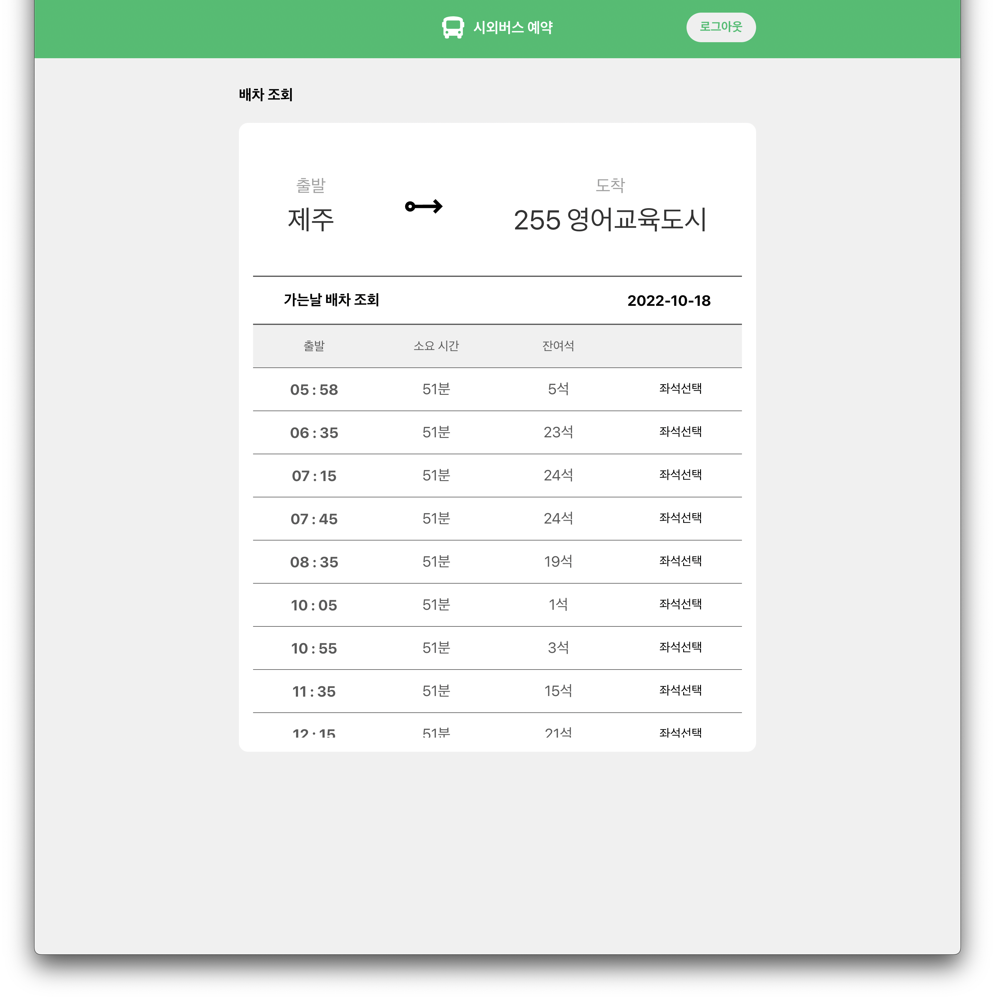
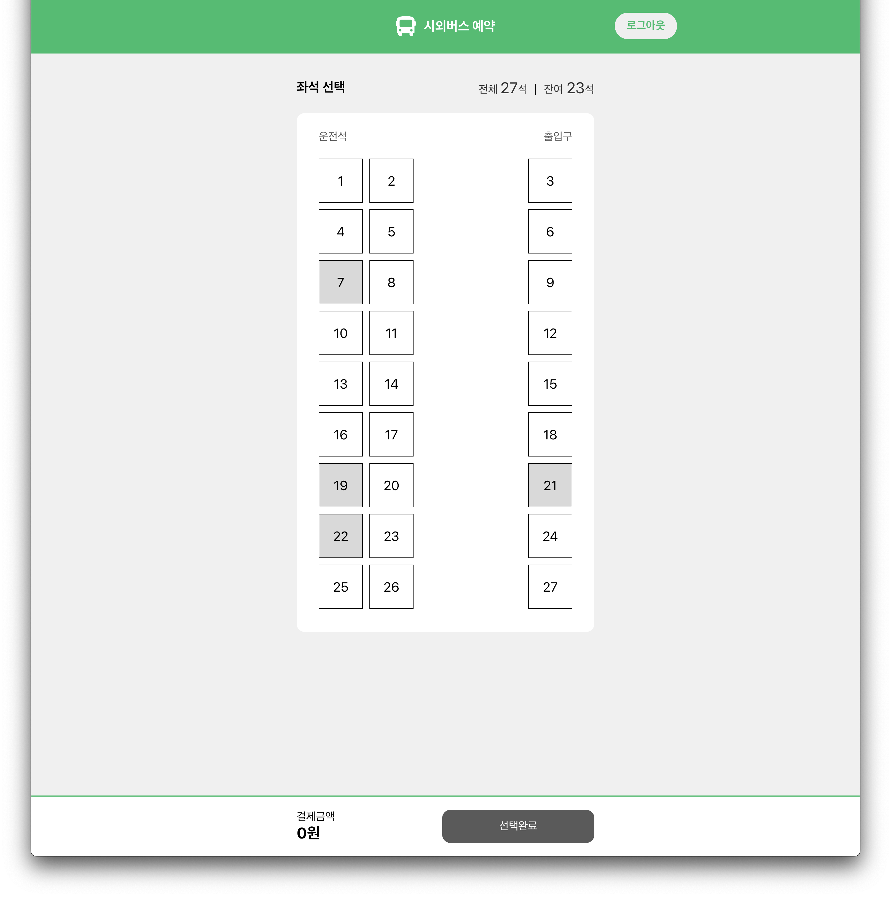
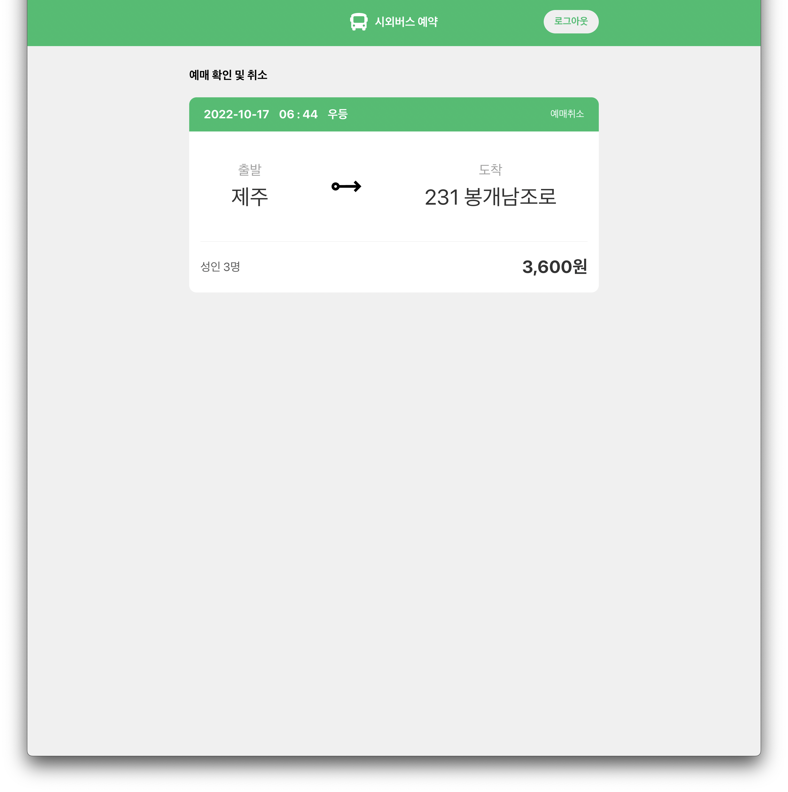

  
# 시외버스 예매 - react project

:bus:
 
   
 
**API 데이터문제로 출발 날짜는 최소 당일 이전부터 해야 도착지가 나옵니다.**
 
**출발지를 서울에 있는 서울남부, 제주에 있는 제주를 클릭하시면 도착할 수 있는 터미널이 많습니다.**

### [react-tmoney-bus.app](https://react-tmoney-bus.vercel.app/)

**[국토교통부_(TAGO)_고속버스정보] 시외버스API 사용**

|                                로그인                                |                              메인 페이지                               |
| :------------------------------------------------------------------: | :--------------------------------------------------------------------: |
|  |  |

|                                Terminal Modal                                |                             Lookup 페이지                             |
| :--------------------------------------------------------------------------: | :-------------------------------------------------------------------: |
|  |  |

|                                Seat                                 |                                MyPage                                 |
| :-----------------------------------------------------------------: | :-------------------------------------------------------------------: |
|  |  |
